<div align="center">

# TRACE

### Not confidence. Coverage.

**AI Decision Underwriting Engine**

<br/>


<br/>

[Overview](#overview) &bull;
[Core Capabilities](#core-capabilities) &bull;
[Architecture](#architecture) &bull;
[Quick Start](#quick-start)

</div>

---

## The Question

Most decision systems ask: *"What should we do?"*

TRACE asks: **"What does it cost if we're wrong, and exactly when does our coverage end?"**

TRACE converts abstract business decisions into structured underwriting problems. Instead of producing a single recommendation or fabricated confidence score, TRACE mathematically evaluates downside exposure, prices the risk, defines explicit coverage limits, and binds the outcome to an immutable decision record.

The goal is not to manufacture certainty. The goal is to make **limits visible**.

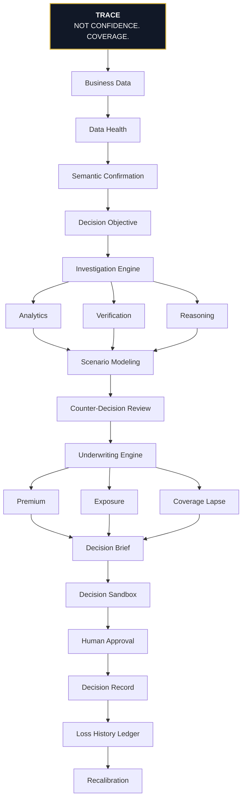

---

## Core Capabilities

### 1. Business Data Intelligence
Automatically ingests raw data, audits it for anomalies, and maps it to a canonical business domain.
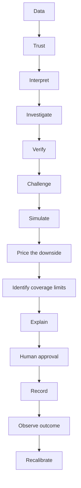

### 2. Semantic Layer
Resolves unstructured data mapping into structured, verifiable metrics.
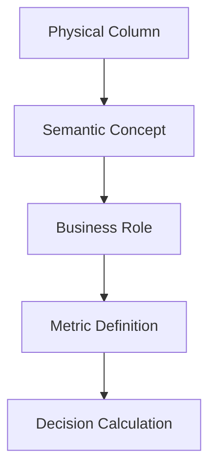

### 3. Decision Objectives
Defines the financial and operational goals of the decision.
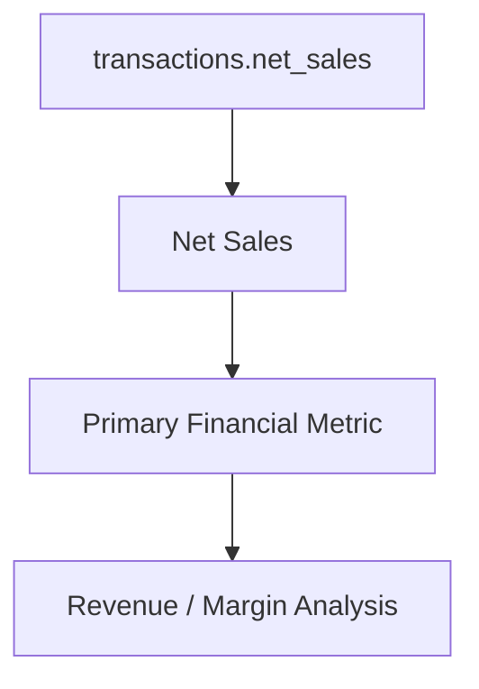

### 4. Investigation Engine
Orchestrates the lifecycle from raw data to underwritten decision.
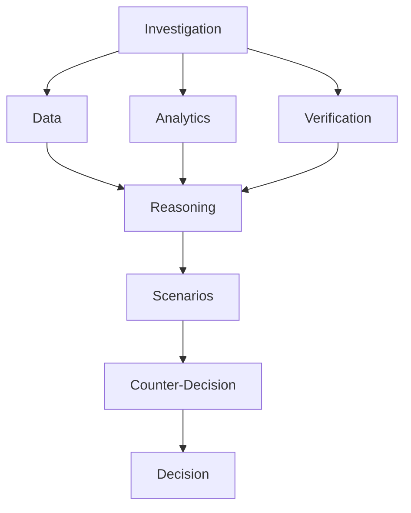

### 5. Deterministic Numerical Truth
LLMs are powerful narrative engines, but they are not numerical authorities. In TRACE, **LLMs do not do math.** All financial calculations execute in isolated Python engines.
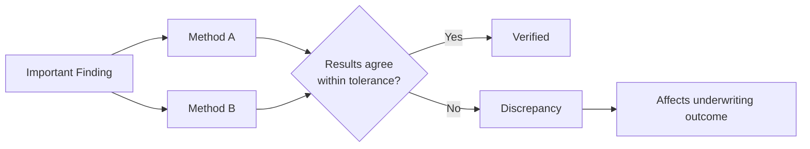

### 6. Verification Engine
Ensures that all metrics and models are verifiable against ground truth data.
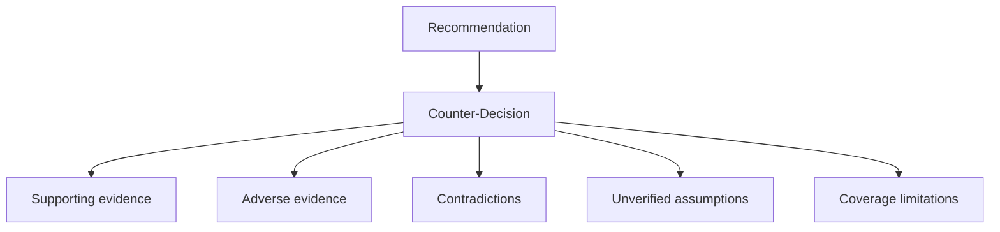

### 7. Counter-Decision Underwriter
Actively builds the strongest possible case *against* the primary recommendation.
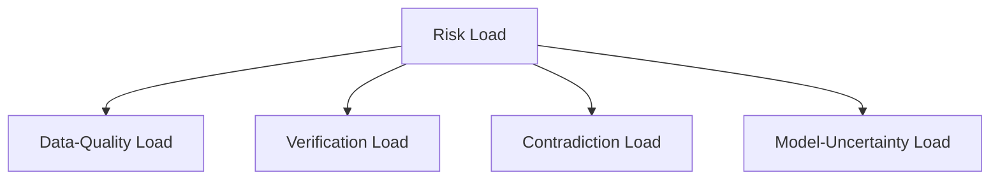

### 8. Scenario Engine
Runs seeded Monte Carlo simulations against historical baselines to project the distribution of outcomes.
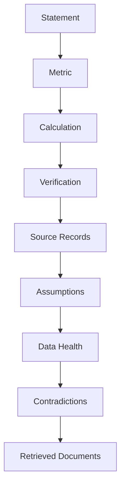

### 9. Decision Premium
Calculates the explicit financial cost of accepting the risk of the decision being wrong.
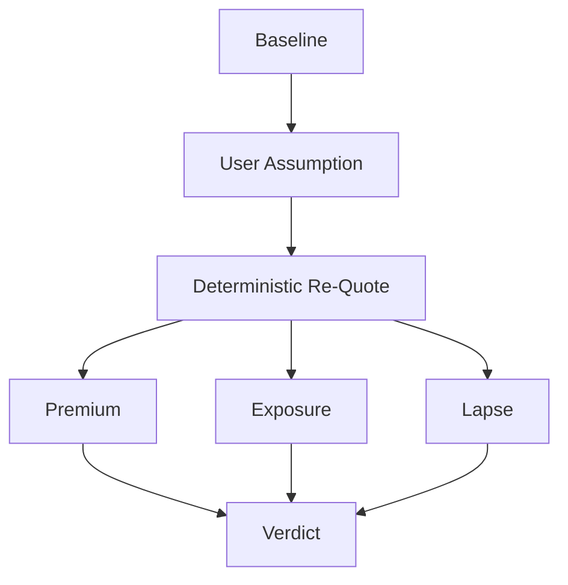

### 10. Exposure Report
Isolates the **P10 Tail Loss**, **Average Worst 10%**, and **Worst Plausible Case**.
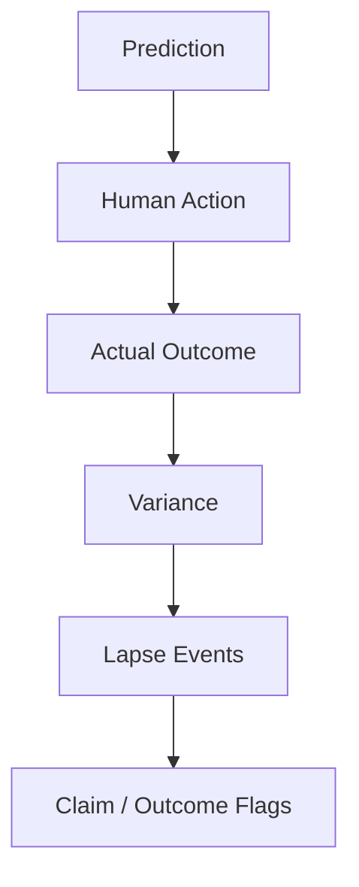

### 11. Coverage Lapse Conditions
A recommendation is only valid until its underlying assumptions break. TRACE calculates explicit **Tripwires**.
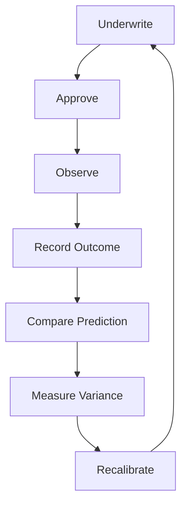

### 12. Verdict Engine
Synthesizes all findings into a final, defensible verdict.
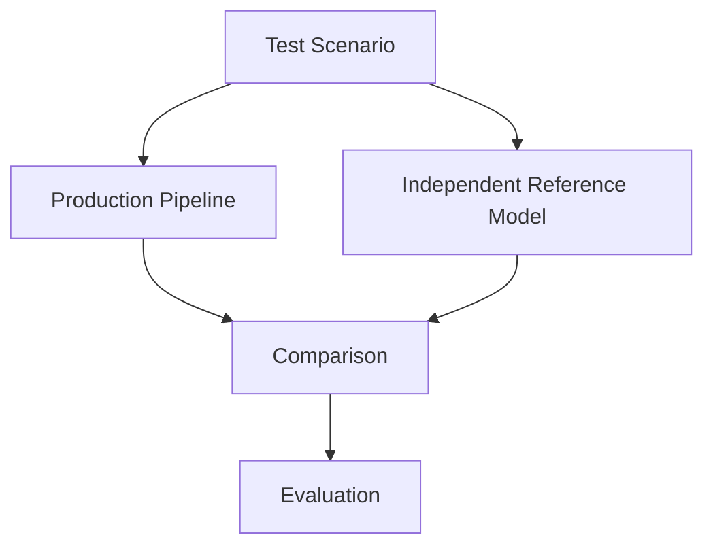

### 13. Evidence Chain & Decision Brief
The human reads a clear, concise brief. The machine maintains a cryptographically verifiable evidence chain.
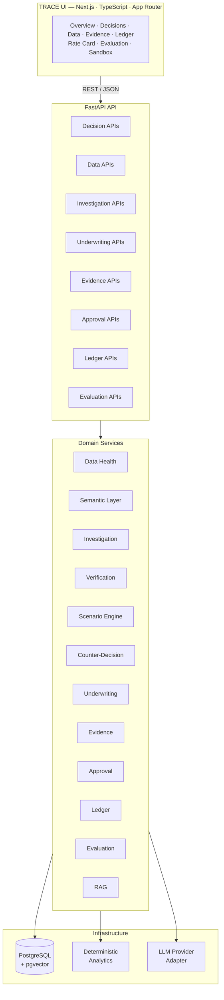

### 14. Decision Sandbox
Allows humans to stress-test the assumptions and immediately see the updated exposure and premium.
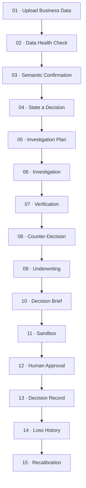

### 15. Human Approval & Decision Records
TRACE recommends and prices. **The human decides.** Human approval writes a hashed Decision Record to the ledger.


### 16. Reproducibility & Determinism
Seeded simulations and versioned logic make results completely reproducible.
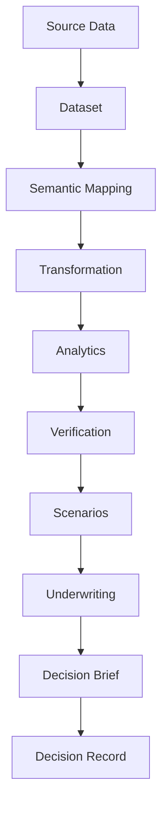

### 17. Data & Decision Provenance
Important numbers are traced mathematically through the system.
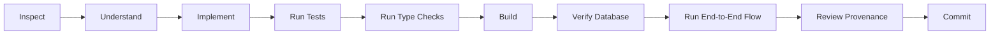

---

## Architectural Principles

1. **Deterministic Truth:** Numerical outputs must come from executable logic, not LLM generations.
2. **Independent Verification:** Findings must survive independent recalculation.
3. **Explicit Uncertainty:** Missing or weak evidence must remain visible.
4. **Provenance:** Important numbers must be mathematically traceable to their source data.
5. **Human Control:** The system supports decisions; humans authorize them.
6. **Honest Failure:** The system prefers to `REFER` or `DECLINE` rather than fabricate certainty.

### Development Workflow
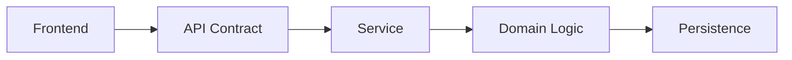

### System Architecture
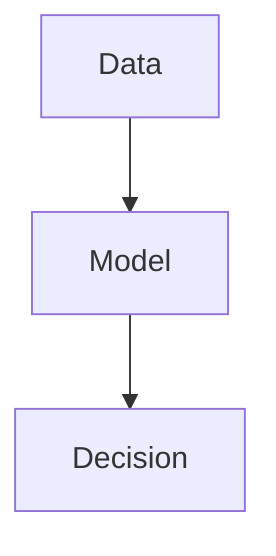

### The TRACE Mental Model
```mermaid
flowchart TD
    A[Data] --> B[Health]
    B --> C[Semantic Layer]
    C --> D[Decision]

    D --> E[Analytics]
    D --> F[Verification]
    E --> G[Scenario]
    F --> G

    G --> H[Counter-Decision]
    H --> I[Underwriting]

    I --> J[Premium]
    I --> K[Exposure]
    I --> L[Lapse]

    J --> M[Brief]
    K --> M
    L --> M

    M --> N[Sandbox]
    N --> O[Human Approval]
    O --> P[Record]
    P --> Q[Ledger]
    Q --> R[Recalibrate]
```

---

## Technology Stack

**Frontend:** Next.js (App Router), React, Tailwind CSS, TypeScript, Recharts
**Backend:** Python, FastAPI, SQLAlchemy, PostgreSQL + `pgvector`, Pydantic
**Intelligence:** Provider-agnostic LLM adapter

---

## Quick Start

### 1. Database
Requires PostgreSQL with `pgvector`.
```bash
docker run -d --name trace-db -p 5432:5432 -e POSTGRES_PASSWORD=trace -e POSTGRES_USER=trace -e POSTGRES_DB=trace ankane/pgvector
```

### 2. Backend
```bash
cd backend
python -m venv venv
source venv/bin/activate  # Windows: .\venv\Scripts\activate
pip install -r requirements.txt
cp .env.example .env
python -m uvicorn app.main:app --reload
```

### 3. Frontend
```bash
cd frontend
npm install
npm run dev
```

---

<div align="center">

### TRACE
*Not confidence. Coverage.*

</div>
