<div align="center">

# TRACE

### Not confidence. Coverage.

**AI Decision Underwriting Engine**

<br/>


<br/>

[Overview](#overview) •
[Why TRACE](#why-trace) •
[Capabilities](#core-capabilities) •
[Architecture](#architecture) •
[Underwriting](#9-decision-premium) •
[Quick Start](#quick-start) •
[Evaluation](#evaluation) •
[Limitations](#known-local-limitation)

</div>

---

## Table of Contents

- [Overview](#overview)
- [The Core Idea](#the-core-idea)
- [Why TRACE?](#why-trace)
- [Core Capabilities](#core-capabilities)
  - [1. Business Data Intelligence](#1-business-data-intelligence)
  - [2. Semantic Layer](#2-semantic-layer)
  - [3. Decision Objectives](#3-decision-objectives)
  - [4. Investigation Engine](#4-investigation-engine)
  - [5. Deterministic Numerical Truth](#5-deterministic-numerical-truth)
  - [6. Verification Engine](#6-verification-engine)
  - [7. Counter-Decision Underwriter](#7-counter-decision-underwriter)
  - [8. Scenario Engine](#8-scenario-engine)
  - [9. Decision Premium](#9-decision-premium)
  - [10. Exposure Report](#10-exposure-report)
  - [11. Coverage Lapse Conditions](#11-coverage-lapse-conditions)
  - [12. Verdict Engine](#12-verdict-engine)
  - [13. Refer / Decline](#13-refer--decline)
  - [14. T1 — Discount Policy](#14-t1--discount-policy)
  - [15. T2 — Price Change](#15-t2--price-change)
  - [16. Decision Brief](#16-decision-brief)
  - [17. Evidence Chain](#17-evidence-chain)
  - [18. Decision Sandbox](#18-decision-sandbox)
  - [19. Human Approval](#19-human-approval)
  - [20. Decision Records](#20-decision-records)
  - [21. Loss History Ledger](#21-loss-history-ledger)
  - [22. Recalibration](#22-recalibration)
  - [23. Rate Card](#23-rate-card)
  - [24. RAG & Evidence Retrieval](#24-rag--evidence-retrieval)
  - [25. Evaluation Harness](#25-evaluation-harness)
  - [26. Ground Truth Firewall](#26-ground-truth-firewall)
  - [27. Adversarial Reliability](#27-adversarial-reliability)
- [Architecture](#architecture)
- [Technology Stack](#technology-stack)
- [Repository Structure](#repository-structure)
- [Demo Data — NovaMart](#demo-data--novamart)
- [Demo Workflow](#demo-workflow)
- [Quick Start](#quick-start)
- [Testing](#testing)
- [Evaluation](#evaluation)
- [Determinism](#determinism)
- [Data → Decision Provenance](#data--decision-provenance)
- [Design Philosophy](#design-philosophy)
- [Security Principles](#security-principles)
- [LLM Architecture](#llm-architecture)
- [Failure Philosophy](#failure-philosophy)
- [What TRACE Is Not](#what-trace-is-not)
- [Current Scope](#current-scope)
- [Future / Vision](#future--vision)
- [Known Local Limitation](#known-local-limitation)
- [Engineering Principles](#engineering-principles)
- [Development Workflow](#development-workflow)
- [Project Status](#project-status)
- [The TRACE Mental Model](#the-trace-mental-model)
- [The Question TRACE Answers](#the-question-trace-answers)
- [License](#license)

---

## Overview

**TRACE** is an AI Decision Underwriting Engine designed to answer a question that conventional analytics systems often leave unresolved:

> **What does it cost if this decision is wrong — and exactly when should we stop believing it?**

TRACE converts business decisions into structured underwriting problems.

Instead of producing a single recommendation or confidence score, TRACE evaluates:

- expected upside
- expected loss
- decision premium
- downside exposure
- data-quality risk
- verification risk
- contradiction risk
- model uncertainty
- scenario distributions
- coverage-lapse conditions
- evidence supporting each important result
- counter-evidence challenging the recommendation
- human approval and modification
- eventual outcome history

The result is a decision that can be **investigated, challenged, priced, approved, recorded and eventually recalibrated**.

---

## The Core Idea

Most decision systems answer:

> **"What should we do?"**

TRACE asks:

> **"What should we do, what does it cost if we're wrong, and under what conditions does that answer stop being defensible?"**

That distinction is the foundation of TRACE.

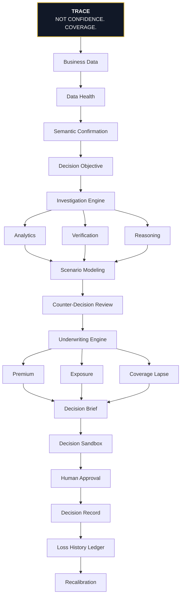

---

## Why TRACE?

Traditional analytics often stop at:

```text
Data → Model → Recommendation
```

TRACE extends the decision lifecycle:

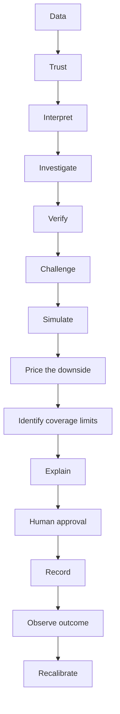

The goal is not to make decisions look more certain.

The goal is to make their **limits visible**.

---

## Core Capabilities

### 1. Business Data Intelligence

TRACE starts by understanding the data before underwriting the decision.

#### Data ingestion

Supports business datasets such as:

- CSV
- XLSX
- benchmark datasets
- structured business tables

#### Data profiling

TRACE inspects:

- row counts
- column types
- missingness
- duplicates
- outliers
- orphan records
- invalid dates
- suspicious values
- relationship integrity
- concentration
- coverage gaps

#### Data Health

Instead of silently proceeding with questionable data, TRACE exposes data quality as an underwriting input.

**Example — Data Health: `90%`**

| Indicator | Count |
| --- | :---: |
| Critical findings | 0 |
| Warnings | 2 |
| Coverage gaps | 1 |
| Relationship issues | 0 |

Data-quality problems can influence the underwriting risk load or prevent a defensible decision entirely.

---

### 2. Semantic Layer

Raw business columns are not automatically business concepts.

TRACE creates a semantic layer between physical data and decision logic.

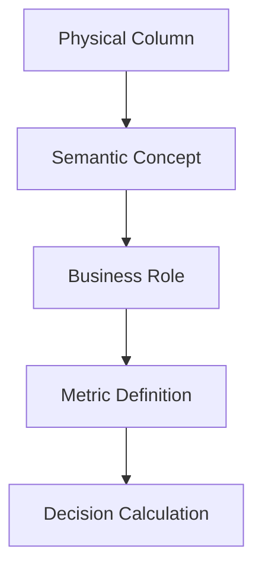

**Example:**

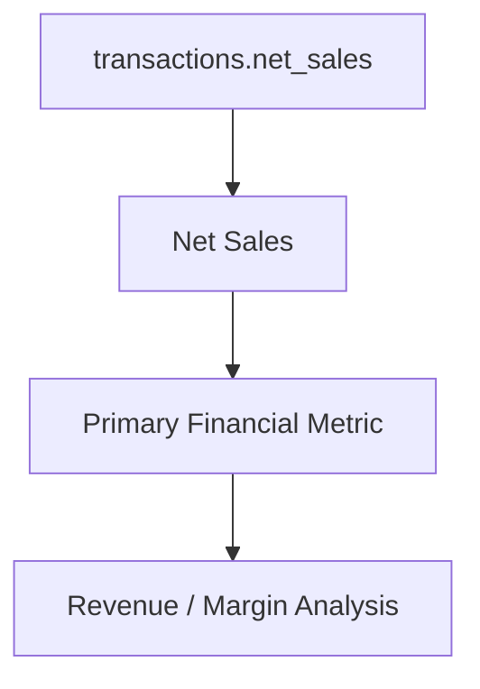

Mappings can be:

- **Suggested**
- **Confirmed**
- **Unmapped**
- **Ambiguous**

TRACE does not silently treat an uncertain mapping as confirmed business truth.

---

### 3. Decision Objectives

TRACE converts a business question into a structured decision object.

**Example:**

> **Should we stop discounts for low-margin customers?**

The decision can contain:

- objective
- baseline
- intervention
- affected population
- horizon
- constraints
- assumptions
- exclusions
- evidence requirements
- investigation plan

This gives the rest of the system a precise target.

---

### 4. Investigation Engine

TRACE uses structured specialist roles rather than allowing a single LLM response to determine the decision.

The investigation architecture includes roles such as:

- Data Agent
- Analytics Agent
- Verification Agent
- Reasoning Agent
- Scenario Agent
- Counter-Decision Underwriter
- Decision Agent

The roles operate within explicit boundaries.

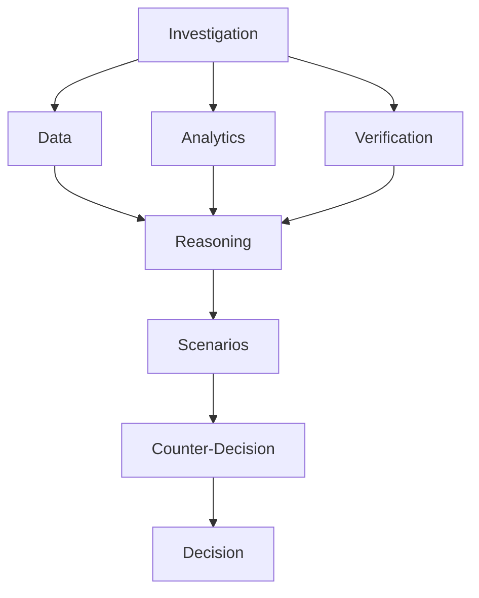

The architecture intentionally separates **reasoning** from **numerical truth**.

---

### 5. Deterministic Numerical Truth

One of TRACE's most important architectural principles:

> **The LLM does not create numerical truth.**

The LLM may:

- interpret
- reason
- summarize
- explain
- classify
- identify possible investigative questions

The LLM may **not** become the authority for:

- Decision Premium
- Expected Loss
- Projected Upside
- probabilities
- scenario arithmetic
- risk-load calculations
- lapse thresholds
- verdict calculations

Those values are produced by deterministic executable code.

---

### 6. Verification Engine

TRACE does not simply trust the first calculation.

Important findings can be independently recalculated using separate methods.

| Verification | Method A | Method B |
| --- | --- | --- |
| **Gross profit** | Primary aggregation | Customer-level reconstruction |
| **Giveaway** | Transaction aggregation | Customer audit |
| **Concentration** | Pareto analysis | Decile analysis |
| **Churn** | Cohort analysis | Inactivity analysis |
| **Elasticity** | Log-linear model | Discount-tier comparison |

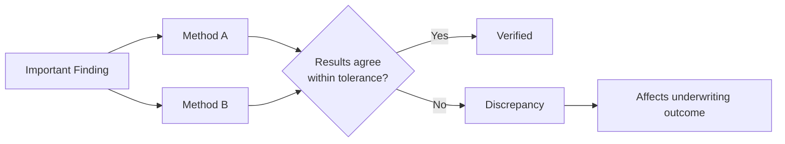

Material discrepancies can affect the underwriting outcome.

---

### 7. Counter-Decision Underwriter

TRACE does not stop after finding evidence supporting the decision.

It actively searches for reasons the decision could be wrong.

The Counter-Decision Underwriter examines adverse vectors such as:

- data weaknesses
- contradictory evidence
- concentration
- segment dependence
- margin sensitivity
- churn risk
- contractual constraints
- scenario fragility
- unsupported assumptions
- model uncertainty

The result is an explicit challenge layer:

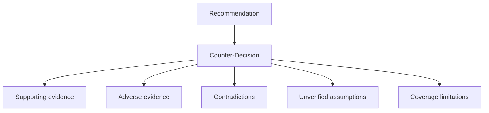

---

### 8. Scenario Engine

TRACE uses deterministic scenario simulation to quantify uncertainty.

For applicable underwriting flows, scenario modeling estimates:

- expected outcome
- downside distribution
- probability of net loss
- quantiles
- tail exposure
- concentration exposure
- adverse outcomes

The scenario engine is seeded for reproducibility.

This means the same input and configuration can produce reproducible results.

---

### 9. Decision Premium

TRACE introduces the concept of a **Decision Premium**.

The decision premium represents the amount of downside/risk that must be priced before treating the recommendation as defensible.

**Core definitions**

| Term | Definition |
| --- | --- |
| **Change in primary outcome** | `ΔM` |
| **Projected Upside** | `U = E[ΔM]` |
| **Expected Loss** | `EL = E[max(0, −ΔM)]` |
| **Decision Premium** | `Decision Premium = Expected Loss + Risk Load` |
| **Premium Rate** | `Premium Rate = Decision Premium / Projected Upside` |

The risk load is decomposed into explicit components.

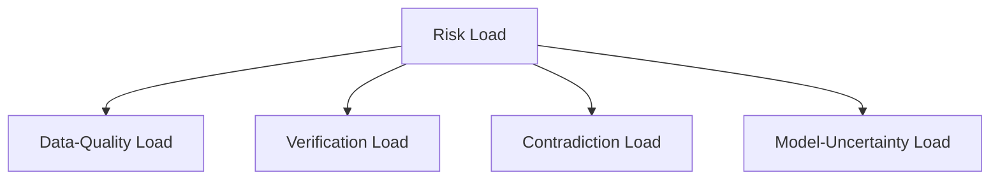

The exact policy values are controlled through the versioned Rate Card rather than hidden frontend constants.

---

### 10. Exposure Report

TRACE does not reduce risk to a single number.

The Exposure Report surfaces multiple dimensions of downside.

It can include:

- probability of net loss
- P10
- P50
- P90
- tail exposure
- worst plausible case
- concentration exposure
- data exposure
- adverse-finding exposure
- Cost of Inaction

The purpose is to show the **shape of the downside**, not merely a point estimate.

---

### 11. Coverage Lapse Conditions

This is one of TRACE's defining capabilities.

A recommendation is not treated as universally valid.

TRACE searches for conditions under which its recommendation stops being defensible.

**Example**

| Metric | Value |
| --- | :---: |
| Current churn | **4.2%** |
| Lapse threshold | **6.79%** |
| Distance to lapse | **2.59 percentage points** |

Possible lapse conditions include:

- threshold
- concentration
- data
- definition
- time
- combination

The system can identify conditions such as:

> Coverage lapses if churn exceeds the specified threshold.

or:

> The recommendation becomes insufficiently supported when the relevant verification discrepancy exceeds policy tolerance.

This turns uncertainty into something operational.

---

### 12. Verdict Engine

TRACE uses deterministic underwriting policy to produce outcomes such as:

| Verdict |
| --- |
| `RECOMMENDED` |
| `RECOMMENDED WITH CONDITIONS` |
| `REFER` |
| `DECLINE` |

The verdict is not generated by an LLM.

It follows the active versioned underwriting policy.

---

### 13. Refer / Decline

TRACE treats **Refer** and **Decline** as legitimate underwriting outcomes.

#### Refer

Used when the decision cannot be safely closed with the available evidence.

Examples:

- insufficient evidence
- unresolved verification discrepancy
- material ambiguity
- unsupported assumption

#### Decline

Used when the decision cannot be supported under the active underwriting policy.

TRACE explains:

- what failed
- why it failed
- what evidence caused the result
- what additional information could change it
- what conditions prevent approval

---

### 14. T1 — Discount Policy

One of the flagship TRACE decisions:

> **Should we stop discounts for low-margin customers?**

The T1 workflow can examine:

- customer profitability
- discount exposure
- giveaway recapture
- churn
- segment behavior
- concentration
- contractual penalties
- scenario outcomes
- verification
- counter-evidence
- coverage lapse

---

### 15. T2 — Price Change

TRACE also supports price-change underwriting.

**Example:**

> **Should we increase the price of Product A?**

T2 can incorporate:

- demand history
- unit gross margin
- observational price sensitivity
- elasticity
- customer segments
- concentration
- competitor evidence where available
- cross-product effects
- scenarios
- lapse conditions
- exposure
- underwriting premium
- verdict

When evidence is unavailable, TRACE explicitly represents that limitation rather than inventing information.

---

### 16. Decision Brief

Every completed underwriting decision can be presented through a structured Decision Brief.

**Canonical order:**

| # | Section |
| :---: | --- |
| 01 | Decision & Verdict |
| 02 | Decision Premium |
| 03 | Exposure Report |
| 04 | Coverage Lapse Conditions |
| 05 | Conditions & Exclusions |
| 06 | Scenarios & Cost of Inaction |
| 07 | What Survived Scrutiny |
| 08 | Data Health |
| 09 | Verification |
| 10 | Evidence Chain |
| 11 | Approval Controls |

The brief is designed around an executive question:

> **Can I defend this decision?**

---

### 17. Evidence Chain

Every major number should be traceable.

TRACE connects:

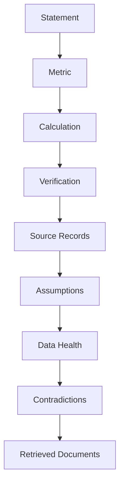

This allows a reviewer to move from an executive-level number to the evidence underneath it.

The objective is not merely explainability.

It is **decision defensibility**.

---

### 18. Decision Sandbox

The Sandbox allows a human reviewer to test assumptions without modifying the original decision.

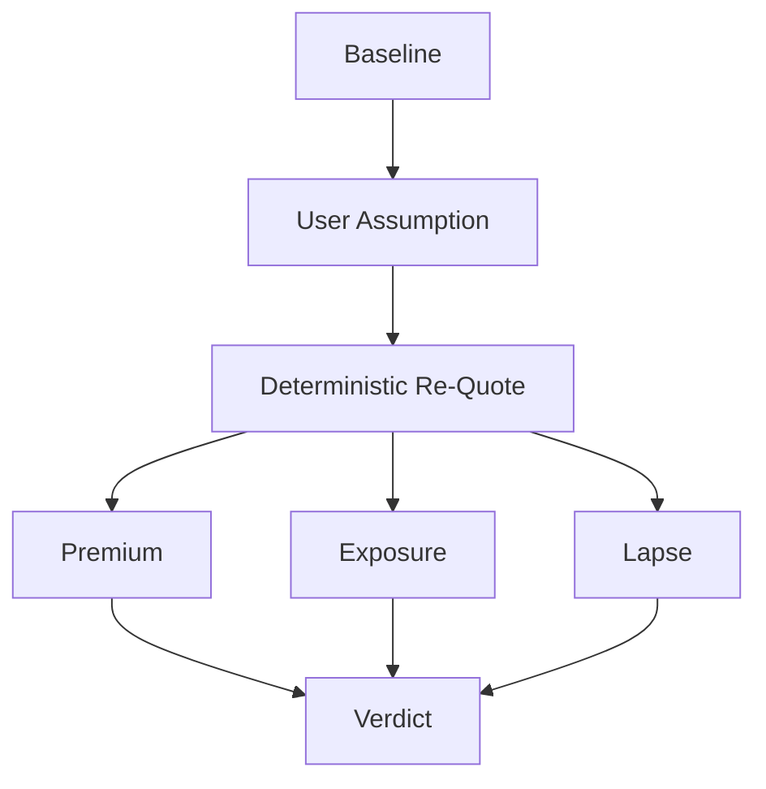

The system preserves:

- parent decision
- modified assumptions
- child scenario
- before/after values
- changed verdict
- lineage

The original decision remains intact.

---

### 19. Human Approval

TRACE keeps humans in control.

The final decision can be:

| Action | Result |
| --- | --- |
| **Approve** | Creates an immutable Decision Record. |
| **Modify** | Creates a new sandbox/decision version while preserving the original. |
| **Reject** | Records the rejection and optional rationale. |

TRACE does not automatically execute the underlying business decision.

---

### 20. Decision Records

Approved decisions are frozen into Decision Records containing relevant snapshots such as:

- decision
- verdict
- premium
- exposure
- lapse conditions
- assumptions
- conditions
- evidence
- verification
- counter-decision findings
- Rate Card version
- human approval
- timestamp
- integrity hash

The record is designed to preserve what was actually approved at that point in time.

---

### 21. Loss History Ledger

TRACE records decision outcomes to build historical underwriting memory.

The ledger can capture:

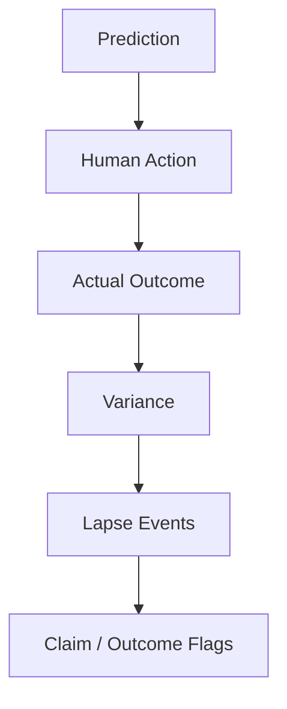

The system can then use accumulated history for recalibration.

For credibility adjustment:

```text
Z = n / (n + k)
```

When no historical experience exists, TRACE uses a neutral baseline.

Synthetic NovaMart history is explicitly labeled as simulated test data.

---

### 22. Recalibration

As actual outcomes accumulate, TRACE can incorporate historical experience into the underwriting model.

The intent is to create a feedback loop:

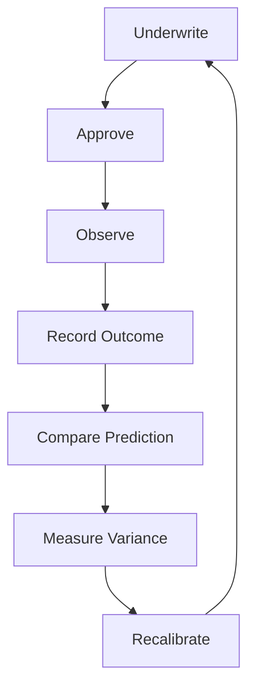

This creates the foundation for a long-term **Loss History Ledger moat**.

---

### 23. Rate Card

TRACE uses a versioned Rate Card to make underwriting policy explicit.

The Rate Card can define:

- risk-load weights
- verdict bands
- tail policy
- lapse policy
- verification tolerance
- recalibration parameters
- experience-factor bounds

Policy is versioned and pinned to relevant decision records.

This prevents hidden business rules from living independently inside the UI or calculation code.

---

### 24. RAG & Evidence Retrieval

TRACE can ingest structured business documents such as:

- pricing policies
- discount guidelines
- customer contract summaries
- regional notes
- business memos

Documents are treated as evidence.

The retrieval layer records relevant provenance such as:

- document
- chunk
- query
- specialist role
- relevance
- timestamp
- decision context

#### Prompt-injection protection

> **Uploaded documents are data, not instructions.**

Document text cannot override:

- system policy
- underwriting rules
- deterministic calculations
- application behavior

---

### 25. Evaluation Harness

TRACE contains an evaluation framework designed to test the decision engine rather than merely the UI.

The evaluation system includes:

- benchmark scenarios
- independent reference calculations
- ground-truth firewall
- numerical consistency checks
- data-health checks
- verification checks
- premium coherence
- verdict behavior
- refer/decline behavior
- sandbox behavior
- failure containment
- adversarial cases
- latency measurements

Example adversarial scenarios include:

- malformed CSV
- missing files
- wrong columns
- duplicate columns
- zero values
- negative values
- empty datasets
- insufficient rows
- broken relationships
- malformed dates
- unsupported documents
- malicious document instructions
- unavailable LLM
- malformed LLM JSON
- verification discrepancies
- scenario failures
- database failures

The evaluation harness is designed to test whether TRACE fails **safely and honestly**.

---

### 26. Ground Truth Firewall

Evaluation ground truth is separated from the production decision pipeline.

The system must not be able to simply read the expected answer and reproduce it.

This protects the benchmark from circular validation.

Conceptually:

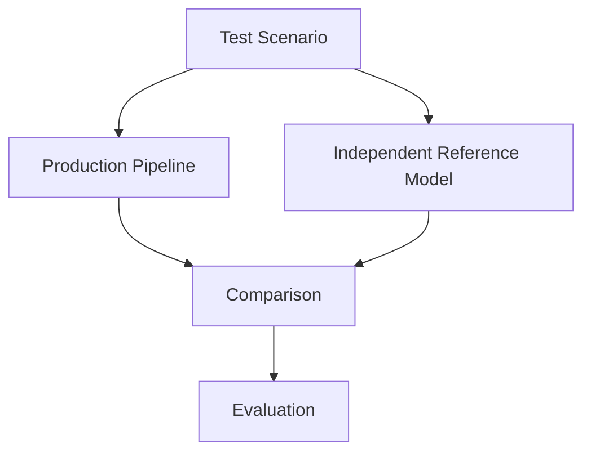

---

### 27. Adversarial Reliability

TRACE is designed to degrade safely.

The system should not invent an answer when:

- data is malformed
- evidence is insufficient
- a document is malicious
- an LLM fails
- a calculation cannot be verified
- a scenario cannot be evaluated
- a database operation fails

The preferred behavior is:

```text
Known
Unknown
Unsupported
Refer
Decline
```

rather than fabricated certainty.

---

## Architecture

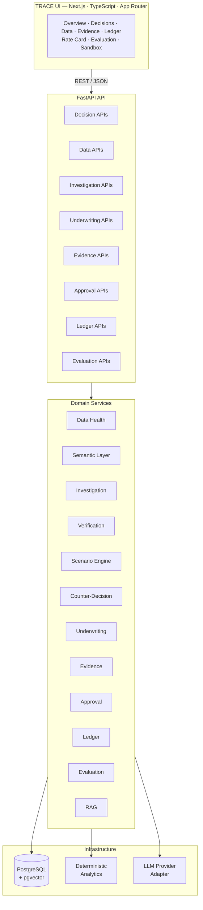

---

## Technology Stack

### Frontend

| Technology | Purpose |
| --- | --- |
| Next.js | Application framework |
| TypeScript | Type safety |
| React | UI |
| App Router | Routing |
| CSS / design tokens | TRACE visual system |
| React visualization layer | Decision analytics |

### Backend

| Technology | Purpose |
| --- | --- |
| Python | Core implementation |
| FastAPI | API layer |
| Pydantic | Contracts / validation |
| SQLAlchemy 2.x | ORM |
| Alembic | Database migrations |
| pytest | Testing |

### Data & Analytics

| Technology | Purpose |
| --- | --- |
| PostgreSQL | Primary database |
| pgvector | Vector retrieval where available |
| pandas | Data processing |
| NumPy | Numerical computation |
| SciPy | Statistical / numerical utilities where required |

### Intelligence

| Component | Purpose |
| --- | --- |
| Deterministic analytics | Numerical truth |
| Scenario Engine | Risk simulation |
| Verification Engine | Independent calculation |
| RAG | Evidence retrieval |
| LLM adapter | Reasoning and explanation |

---

## Repository Structure

```text
TRACE/
│
├── backend/
│   ├── app/
│   │   ├── api/
│   │   ├── models/
│   │   ├── schemas/
│   │   ├── services/
│   │   ├── underwriting/
│   │   ├── evaluation/
│   │   ├── db/
│   │   └── main.py
│   │
│   ├── tests/
│   └── alembic/
│
├── frontend/
│   ├── app/
│   │   ├── decisions/
│   │   ├── data/
│   │   ├── evidence/
│   │   ├── ledger/
│   │   ├── rate-card/
│   │   ├── evaluation/
│   │   └── ...
│   │
│   ├── components/
│   ├── lib/
│   └── package.json
│
├── .env.example
├── .gitignore
├── .dockerignore
├── README.md
└── ...
```

---

## Demo Data — NovaMart

TRACE includes a deterministic synthetic benchmark environment called **NovaMart**.

NovaMart is designed specifically to exercise:

- data-quality problems
- semantic ambiguity
- customer concentration
- discount sensitivity
- contractual constraints
- seasonality
- aggregation traps
- missing competitor evidence
- verification discrepancies
- insufficient-data decisions

The benchmark includes synthetic business entities such as:

- customers
- products
- transactions
- regions
- discounts
- supporting business documents

The dataset is synthetic.

> **NovaMart is not real company data and does not represent real-world commercial performance.**

Any historical ledger entries generated from NovaMart are likewise simulated.

---

## Demo Workflow

A complete TRACE demonstration follows:

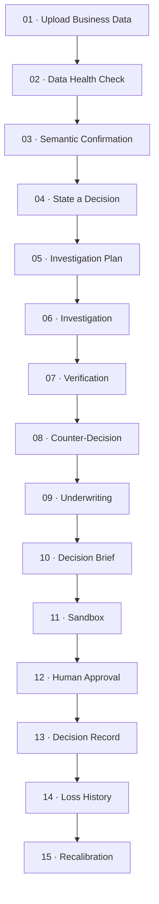

The flagship decision is:

> **Should we stop discounts for low-margin customers?**

---

## Quick Start

### Prerequisites

Recommended environment:

- Python 3.x
- Node.js
- npm
- PostgreSQL
- Git

Optional:

- PostgreSQL `pgvector` extension for vector retrieval

TRACE can use a deterministic local retrieval fallback when `pgvector` is unavailable.

---

### 1. Clone the Repository

```bash
git clone <YOUR_REPOSITORY_URL>
cd TRACE
```

### 2. Configure Environment Variables

Copy the example configuration:

```bash
cp .env.example .env
```

On Windows PowerShell:

```powershell
Copy-Item .env.example .env
```

Edit `.env` with your local configuration.

> ⚠️ Never commit `.env`.

---

### Backend Setup

#### 3. Create a Python Environment

**Windows**

```powershell
python -m venv .venv
.venv\Scripts\Activate.ps1
```

**macOS / Linux**

```bash
python3 -m venv .venv
source .venv/bin/activate
```

#### 4. Install Backend Dependencies

From the project root:

```bash
pip install -r backend/requirements.txt
```

If the repository uses a different dependency file, follow the dependency file present in the current repository.

---

### Database Setup

Create a PostgreSQL database for TRACE.

Example:

```sql
CREATE DATABASE trace;
```

Configure the database URL in `.env`.

Then run:

```bash
python -m alembic upgrade head
```

Verify the migration state:

```bash
python -m alembic current
```

and:

```bash
python -m alembic heads
```

---

### Start the Backend

From the repository root:

```bash
uvicorn backend.app.main:app --reload
```

The API will normally be available at:

```text
http://localhost:8000
```

FastAPI documentation:

```text
http://localhost:8000/docs
```

---

### Frontend Setup

Open another terminal.

```bash
cd frontend
npm install
```

Then configure the frontend environment if required by `.env.example`.

Start the development server:

```bash
npm run dev
```

The frontend will normally be available at:

```text
http://localhost:3000
```

---

### Production Build

Build the frontend:

```bash
npm run build
```

Run the production server according to the repository's deployment configuration.

---

## Testing

Run the backend test suite:

```bash
python -m pytest backend/tests -q
```

Run TypeScript checks:

```bash
cd frontend
npm run type-check
```

Build:

```bash
npm run build
```

Database migration check:

```bash
python -m alembic check
```

---

## Evaluation

TRACE includes an evaluation harness designed around deterministic reference calculations and adversarial testing.

The evaluation system measures multiple dimensions including:

- data-health behavior
- deterministic underwriting
- verification
- premium coherence
- verdict behavior
- refer/decline handling
- sandbox behavior
- numerical firewall
- adversarial resilience
- performance

The evaluation framework is intended to answer:

> **Does TRACE still behave correctly when its assumptions, inputs, evidence or supporting systems are attacked?**

---

## Determinism

TRACE prioritizes reproducibility.

Important calculations are deterministic and scenario simulations use controlled seeds.

Conceptually:

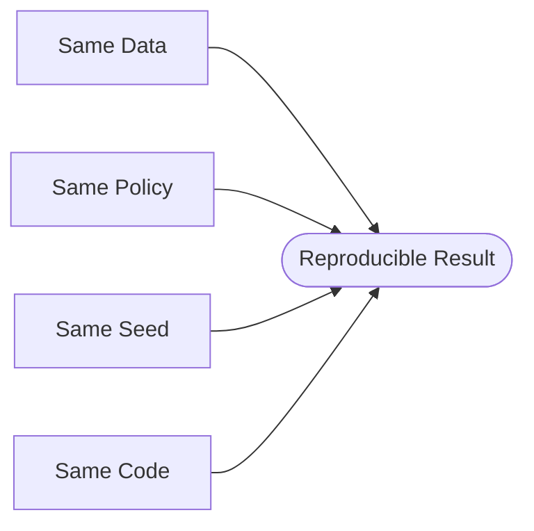

This makes evaluation, debugging and decision records significantly more defensible.

---

## Data → Decision Provenance

TRACE is designed so that important numbers can be traced through the system.

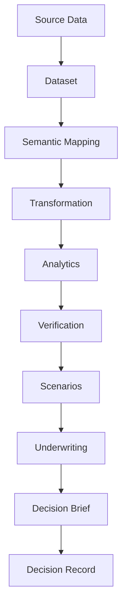

The objective is to prevent unexplained numbers from appearing in executive decisions.

---

## Design Philosophy

TRACE intentionally follows a different visual philosophy from typical AI products.

| Principle | Meaning |
| --- | --- |
| **Decision-first** | The user should see the decision and its economics before reading long explanations. |
| **Numbers before prose** | Important metrics should be immediately visible. |
| **Evidence is interactive** | Important numbers should lead to their underlying evidence. |
| **Uncertainty is visible** | Unknowns and limitations should not be hidden. |
| **Coverage is operational** | A recommendation should communicate when it stops being valid. |
| **Human approval remains explicit** | TRACE supports decision-making; it does not silently execute business decisions. |

---

## Security Principles

TRACE follows several important security boundaries.

| Principle | Description |
| --- | --- |
| **Documents are data** | Uploaded or retrieved documents cannot override system instructions or underwriting policy. |
| **LLMs are not numerical authorities** | Financial truth comes from deterministic executable logic. |
| **Secrets stay outside source control** | Environment-specific credentials belong in environment configuration. |
| **Validation occurs at boundaries** | Input validation and database constraints are used to prevent malformed state. |
| **Decision Records are immutable** | Approved records preserve the state of the decision at approval time. |

---

## LLM Architecture

TRACE uses a provider-agnostic LLM adapter.

The model is used for tasks such as:

- reasoning
- explanation
- interpretation
- structured narrative
- investigative assistance

The model does not directly control:

```text
Premium
Expected Loss
Expected Upside
Risk Load
Lapse Threshold
Verdict
Scenario Arithmetic
```

This separation is intentional.

---

## Failure Philosophy

TRACE prefers an honest limitation over fabricated certainty.

| Situation | Outcome |
| --- | --- |
| Evidence is insufficient | `REFER` |
| The decision cannot be supported | `DECLINE` |
| A calculation cannot be verified | `REFER` |
| A required input is unavailable | `NOT AVAILABLE` |
| A relationship cannot be tested | `NOT TESTABLE WITH AVAILABLE EVIDENCE` |

> The system should never convert missing information into invented information.

---

## What TRACE Is Not

TRACE is not:

- an insurance product
- an insurance claims platform
- a claims payout system
- a policy issuance platform
- an automated decision-execution system
- a replacement for human governance
- a generic chatbot
- a generic BI dashboard
- a confidence-score generator

TRACE is a **decision underwriting and defensibility system**.

---

## Current Scope

TRACE currently focuses on:

- structured business data
- deterministic decision analytics
- decision underwriting
- scenario analysis
- verification
- counter-decision analysis
- evidence retrieval
- human approval
- historical decision recording
- synthetic benchmark evaluation

---

## Future / Vision

The following capabilities are intentionally outside the current prototype scope:

- live CRM connectors
- live BI connectors
- automated outcome collection
- automated tripwire alerts
- organization-wide governance
- multi-user enterprise workflows
- automated decision execution

These are future architectural directions rather than claims of current functionality.

---

## Known Local Limitation

On environments where PostgreSQL does not have the `pgvector` extension available, TRACE can fall back to deterministic lexical/keyword retrieval behavior for document search.

This limitation is intentional and documented.

The system must never pretend that vector retrieval is available when the extension is not installed.

For production environments requiring vector similarity, install and configure PostgreSQL with `pgvector`.

---

## Engineering Principles

TRACE follows several non-negotiable engineering principles.

1. **Deterministic numerical truth** — Numerical outputs must come from executable deterministic logic.
2. **Independent verification** — Important findings should survive independent recalculation.
3. **Explicit uncertainty** — Missing or weak evidence must remain visible.
4. **Provenance** — Important numbers should be traceable to their source.
5. **Versioned policy** — Underwriting policy must be explicit and versioned.
6. **Human control** — Humans approve, modify or reject final decisions.
7. **Reproducibility** — Seeded simulations and versioned policy make results reproducible.
8. **Honest failure** — The system should REFER, DECLINE or report limitations rather than fabricate certainty.

---

## Development Workflow

A typical development cycle is:

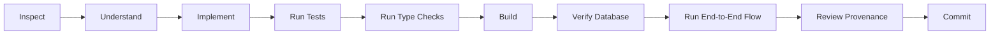

Avoid introducing business logic directly into frontend components.

Prefer:

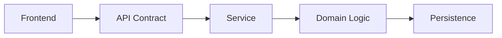

---

## Project Status

TRACE is an advanced prototype / hackathon-grade decision underwriting system.

The core system currently includes:

- deterministic underwriting
- T1 Discount Policy
- T2 Price Change
- Data Health
- Semantic Layer
- Investigation orchestration
- Verification
- Counter-Decision
- RAG
- Decision Premium
- Exposure
- Coverage Lapse
- Refer / Decline
- Decision Brief
- Sandbox
- Human Approval
- Decision Records
- Evidence Chain
- Loss History Ledger
- Recalibration
- Rate Card
- Evaluation Harness
- adversarial testing
- demo resilience

The system is designed to demonstrate the TRACE methodology using deterministic synthetic business data.

---

## The TRACE Mental Model

**Traditional decision systems:**

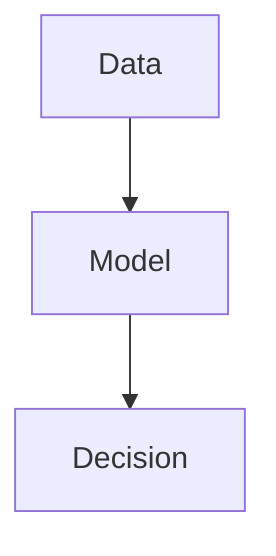

**TRACE:**

```mermaid
flowchart TD
    A[Data] --> B[Health]
    B --> C[Semantic Layer]
    C --> D[Decision]

    D --> E[Analytics]
    D --> F[Verification]
    E --> G[Scenario]
    F --> G

    G --> H[Counter-Decision]
    H --> I[Underwriting]

    I --> J[Premium]
    I --> K[Exposure]
    I --> L[Lapse]

    J --> M[Brief]
    K --> M
    L --> M

    M --> N[Sandbox]
    N --> O[Human Approval]
    O --> P[Record]
    P --> Q[Ledger]
    Q --> R[Recalibrate]
```

---

## The Question TRACE Answers

Most analytics products ask:

> **"How confident are we?"**

TRACE asks:

> **"How much does being wrong cost us — and where does our coverage end?"**

---

<div align="center">

### TRACE

*Not confidence. Coverage.*

Decision Underwriting Engine

</div>

---

## License

This project is currently intended as a prototype / research / hackathon implementation.

Add an explicit open-source license here only if one has actually been selected for the repository.